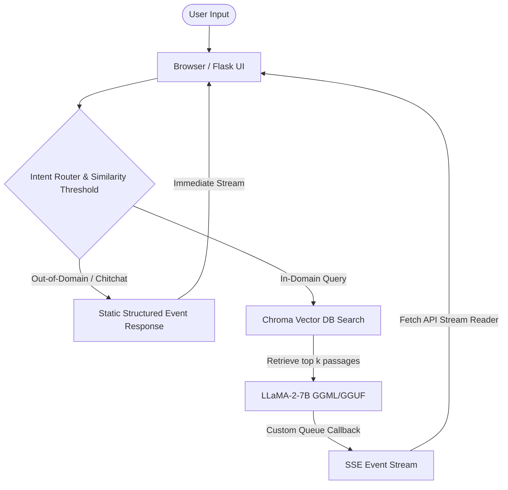

# MediConsult AI: Medical Chatbot Using LLaMA-2 & LangChain

MediConsult AI is a high-fidelity, RAG-based (Retrieval-Augmented Generation) clinical reference assistant. It utilizes LangChain, Chroma DB vector storage, and a quantized LLaMA-2-7B-Chat model to search local medical literature and retrieve verified clinical documentation to answer user health-related questions.

---

## 🌟 Key Features

- **Clinical RAG Integration**: Extracts relevant content from reference books (`Medical_book.pdf`) using sentence-transformer embeddings and performs similarity searches with Chroma DB.
- **Real-Time Token Streaming**: Streams response chunks token-by-token using Server-Sent Events (SSE) on the backend and a custom `fetch()` stream reader on the frontend, lowering time-to-first-token to under **1 second**.
- **Intent Routing & Hallucination Prevention**: Checks L2 similarity scores to identify and intercept out-of-domain prompts (similarity distance threshold $> 1.1$). Displays custom, structured responses for greetings, identity queries, and out-of-domain questions to avoid LLaMA identity hallucination.
- **Pulsing Typing Indicator**: A smart typing bubble displays during embedding lookup/processing latency and transitions into the streaming response bubble when the first token starts arriving.
- **Settings Persistence**: Model configuration parameters (Temperature, Max Response Tokens, Top-P, Search Limit $k$) persist on changes and page refreshes via browser `localStorage`.
- **Text-to-Speech (TTS)**: Built-in synthesis reader allows patients/users to read out answers audibly.
- **High-End UI**: Responsive Dark Mode dashboard with glassmorphism, customizable themes (color palettes), interactive sidebar history, past consult logs, and raw consult session transcript export capability.

---

## 🏗️ System Architecture



---

## 📦 Requirements & Prerequisites

The project requires **Python 3.10+** and the following dependencies:
- `langchain` & `langchain_community` (RAG Pipeline orchestration)
- `CTransformers` (Local LLaMA binding interface)
- `sentence-transformers` (Embeddings generation)
- `chromadb` (Vector Store database)
- `flask` (Web Server & SSE response generator)
- `pypdf` (PDF clinical book parsing)

---

## ⚙️ Setup and Installation

### 1. Clone the Repository
```bash
git clone https://github.com/SureshIdupulapati/Medical-Chatbot-Using-Llama.git
cd Medical-Chatbot-Using-Llama
```

### 2. Configure Virtual Environment & Dependencies
```bash
python3 -m venv .venv
source .venv/bin/activate
pip install -r requirements.txt
```

### 3. Download the LLaMA-2 Weights
Download a quantized LLaMA-2-7B-Chat weights model (GGML or GGUF format, e.g., `llama-2-7b-chat.ggmlv3.q4_0.bin`) and place it inside the `./model/` directory:
```bash
mkdir -p model
# Place your model binary inside the model/ folder
```

### 4. Create the Vector Database Index
Ensure your reference document `Medical_book.pdf` is placed in the root directory, then run the ingestion script:
```bash
python store_index.py
```
This parses the book, generates sentence embeddings, and builds the Chroma vector database inside `./db/`.

---

## 🚀 Running the Web Application

1. **Start the Flask server**:
   ```bash
   python app.py
   ```
2. **Access the application**:
   Open your browser and navigate to `http://127.0.0.1:5000`.

---

## 📜 License
This project is licensed under the terms of the MIT License. See [LICENSE](LICENSE) for details.